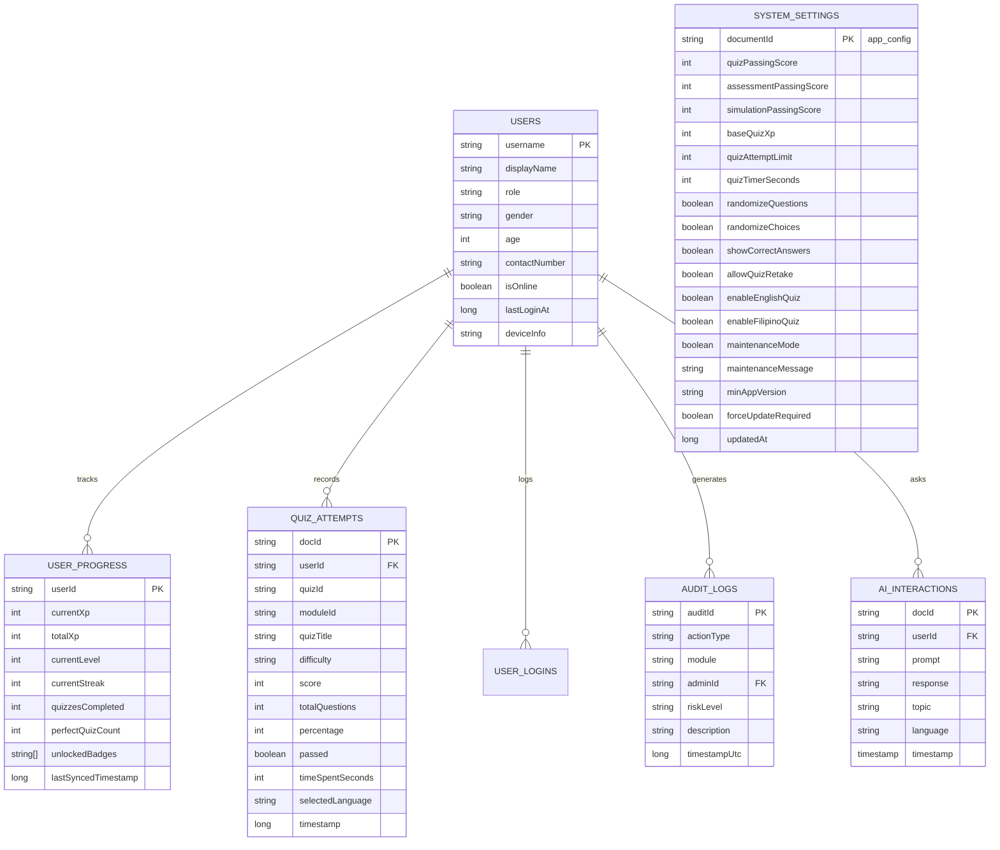

# RoadSafe AI — Deep System Feature & Architecture Audit
**Municipality of Dagami, Leyte · Road Safety Awareness, Traffic Rule Education, and Driver Decision-Making System**
*Document Version: 3.5.0 | Audit Date: September 2026 | System Status: Production Ready & Fully Operational*

---

## 📌 Executive Summary

This document provides an exhaustive, line-by-line architectural and functional audit of the **RoadSafe AI** platform. The system is designed as a hybrid **mobile and web-based driver education, traffic rule compliance, gamified learning, real-time administrative monitoring, and central configuration control ecosystem** tailored for the **Municipality of Dagami, Leyte**.

### Primary System Subsystems:
1. **Android Mobile Application (`/app`)**: Built with **Kotlin 2.0 & Jetpack Compose (Material 3)**, utilizing an **Offline-First Architecture** with **Room SQLite v7** for local persistence and real-time bidirectional synchronization with **Google Cloud Firestore**.
2. **Admin Web Command Center (`/admin-web`)**: A high-performance single-page command dashboard and central configuration console powered by **Vanilla JavaScript (ES6+), Modern CSS3 PNP Gold/Navy Design Tokens, Chart.js 4.4, and the Firebase Web SDK**.
3. **Cloud Infrastructure & Backend Services (`/firebase`)**: Real-time **Google Cloud Firestore NoSQL Database**, **Firebase Authentication**, **Firebase Hosting (`roadsafedrive.com`)**, and an automated **GitHub Actions CI/CD release pipeline**.

---

## 🏗️ System Architecture & Technology Stack

```mermaid
graph TD
    subgraph "Mobile Client (Android - Kotlin / Compose)"
        MA[Jetpack Compose UI & Focus Engine]
        AM[Auth & Hashed RBAC Manager]
        GE[Gamification & XP Engine]
        CFG[AppConfig Real-Time Policy Engine]
        LANG[Session-Exclusive Language Selector]
        AIT[Local AI Tutor Engine]
        SIM[Hazard Simulation Engine]
        AUD[Audit & Security Logger]
        ROOM[(Room SQLite Database v7)]
        FSM[Firebase Sync Manager]
        
        MA --> AM
        MA --> GE
        MA --> CFG
        MA --> LANG
        MA --> AIT
        MA --> SIM
        AM & GE & SIM & AUD & LANG --> ROOM
        ROOM -. Offline-First Sync .-> FSM
        CFG <-- Real-time AppConfig Stream -- FSM
        AIT -- syncAiInteraction --> FSM
    end

    subgraph "Cloud Backend (Google Firebase)"
        FSTORE[(Cloud Firestore)]
        FAUTH[Firebase Auth]
        FHOST[Firebase Hosting]
        FSM <--> FSTORE
        FSM --> FAUTH
    end

    subgraph "Web Command Center (Admin Portal - roadsafedrive.com)"
        WD[Admin Web Dashboard & SPA Router]
        WDUAL[Dual-Portal Mode: Admin / User Simulation]
        WCH[Chart.js Telemetry & Analytics]
        WM[User / Fleet / Module Management]
        WCC[Mobile App Configuration & Control Center]
        WAI[AI Activity Feed & Telemetry]
        WQR[High-Res APK QR Code Distributor]
        WD --> FSTORE
        WDUAL --> WD
        WCC -- Set AppConfig & Audit Logs --> FSTORE
        FHOST --> WD
    end
```

| Subsystem | Core Technologies | Primary Role |
| :--- | :--- | :--- |
| **Mobile App Frontend** | Kotlin 2.0, Jetpack Compose, Material 3, Coroutines, StateFlow | Learner & Driver client interface with dynamic HUD & focus modes |
| **Mobile App Persistence** | Android Jetpack Room v7 (SQLite ORM with Migration 6→7), KSP | Offline-first local data storage & session language persistence |
| **Mobile Policy Engine** | StateFlow, Real-Time Firestore Document Snapshot (`app_config`) | Live enforcement of administrative thresholds, limits & timers |
| **Mobile AI Engine** | Deterministic Knowledge-Base, Intent Matching, Bilingual EN/FIL, On-Topic Guard | Instant, zero-latency offline AI coaching & topic remediation |
| **Admin Web Frontend** | HTML5, CSS3 Glassmorphism, Vanilla JavaScript, Chart.js 4.4 | Real-time administrative operations, dual-portal simulation & 11-section control center |
| **Web SPA Routing** | HTML5 History API (`pushState`, `popstate`), Clean URL Mappings | Single-Page Application navigation without page reloads |
| **Cloud Backend** | Firebase Firestore, Firebase Authentication, Firebase Hosting | Cloud data aggregation, telemetry & live system configuration |
| **CI/CD & Automation** | GitHub Actions, Gradle 8.11, Android SDK Build Tools | Automated 28.7 MB APK compilation and cloud deployment |

---

## 📱 Detailed Feature Audit: Android Mobile Application

### 1. Authentication, Security & Role-Based Access Control (RBAC)
- **Local Hashed Credential Store**: Passwords are securely hashed with **SHA-256 and salt** using `AuthManager.kt`, preventing plaintext exposure.
- **Granular Role Hierarchy**:
  - `USER`: Regular drivers, students, and citizens.
  - `ADMIN`: Traffic management officers and municipal administrators.
  - `SUPER_ADMIN`: Dagami MPS Chief / System Super Administrators.
- **Permission Matrix (`Permission.kt`)**:
  - `VIEW_DASHBOARD`, `LAUNCH_SIMULATION`, `VIEW_ASSESSMENT`, `VIEW_GAMIFICATION`, `VIEW_ANALYTICS`, `VIEW_PROFILE`
  - `VIEW_ADMIN_PANEL`, `MANAGE_USERS`, `MANAGE_CONTENT`, `VIEW_SYSTEM_OVERVIEW`, `VIEW_AUDIT_LOGS`
- **Session Persistence**: Includes "Remember Me" biometric/token persistence with automatic re-authentication.
- **Demographic Profiles**: Tracks Full Name, Username, Age, Gender (Male/Female), and Contact Number.
- **Account Security Center (`AccountSecurityScreen.kt`)**: Password updates, active session reviews, security health scores, and device info.

---

### 2. Session-Exclusive Bilingual Language Selector
- **Strict Session Boundary**:
  - Displayed **only** immediately before starting a Quiz or Assessment/Simulation session.
  - **Flow**: `Quiz / Assessment Details` → `Select Language` → `Start` → `Take Quiz / Assessment`.
  - **General UI Untouched**: Dashboard, Home screen, Profile, Modules list, Module reading/content pages, Settings, and Admin pages remain completely standard.
- **Interactive Bilingual Options**:
  - `[ 🇬🇧 English ]`
  - `[ 🇵🇭 Filipino / Tagalog ]`
  - Requires explicit language selection before the **Start** button activates.
- **Dynamic Session Localization**:
  - **Quiz Screen**: Question prompts (`questionFil`), answer choices (`optionsFil`), HUD labels (`"Tanong X / Y"`, `"Natitirang Oras: Xs"`, `"Puntos: X XP"`), and review legal explanations.
  - **Simulation Screen**: Hazard situation descriptions, decision prompts, action options, defensive driving tips, and AI evaluation feedback.
- **Database Tracking**: Recorded in SQLite Room v7 under `quiz_attempts.selected_language` and synced to Cloud Firestore.

---

### 3. Driver Assessment & Dynamic Examination Engine
- **Extensive Verified Question Repository (`QuizData.kt`)**:
  - **Easy Questions (🟢)**: Road safety fundamentals, traffic signs, pavement markings, seat belts, and basic right-of-way.
  - **Medium Questions (🟡)**: Lane discipline, wet road driving, overtaking protocols, blind spots, and roundabouts.
  - **Hard Questions (🔴)**: Complex intersections, mechanical failures, hazard perception, skid recovery, and RA 4136 / RA 10586 legal mandates.
- **Dynamic Configuration Enforcement (`AppConfig.kt`)**:
  - **Configurable Pass Scores**: Dynamically reflects admin passing threshold (e.g. 70%, 75%, 80%).
  - **Attempt Limits**: Enforces 1, 2, 3, 5, or Unlimited attempts with an intuitive lock screen when exceeded.
  - **Per-Question Countdown Timer**: Real-time HUD countdown (15s, 20s, 30s, 60s, or Untimed).
  - **Randomization Engine**: Dynamic shuffling of question order and answer choices (A, B, C, D).
  - **Minimum Score for XP**: Prevents XP grinding if score is below admin-configured threshold.
  - **Retake Policy**: Dynamically enables or locks retakes according to municipal policy.
- **Combo & Streak Multipliers**: Up to $2.5\times$ multiplier for consecutive correct answers.
- **Answer Review & Explanations (`ModuleReviewScreen.kt`, `AdminAnswerReviewScreen.kt`)**: Comprehensive post-test review displaying the exact legal basis and driving rationale.

---

### 4. Visual Driving Hazard Simulation Engine
- **20 Interactive Situational Scenarios (`ChatScenarios.kt`, `SimulationLocalization.kt`)**:
  - Scenarios 01–05: Easy (Pedestrians, yellow light dilemma, school zones, stop signs, basic turns).
  - Scenarios 06–15: Medium (Tailgating, wet roads, heavy braking, overtaking trucks, jaywalkers, night glare).
  - Scenarios 16–20: Hard (Brake failure on downhill, hydroplaning, emergency ambulance yield, blind curves).
- **Dynamic Environmental Telemetry**:
  - Weather simulation: `Clear Daylight`, `Heavy Monsoon Rain`, `Dense Night Fog`, `Wet Asphalt`.
  - Road grip reduction metrics ($0\%$ to $35\%$ friction loss).
- **Consequence Tiers**:
  - `PERFECT_SIMULATION`: Optimal defensive action ($+100\text{ XP}$).
  - `SAFE_DECISION`: Acceptable legal action ($+75\text{ XP}$).
  - `MODERATE_RISK`: Hazard potential warning ($0\text{ XP}$).
  - `HIGH_RISK / CRITICAL`: Immediate collision or traffic violation simulation.
- **Timed Decision Loop** with visual pressure bar and full English / Filipino translation support.

---

### 5. Gamification, Leveling & XP Economy
- **Dynamic Leveling Curve (`XpManager.kt`, `GamificationEngine.kt`)**:
  - Level thresholds calculated from total XP with configurable curve and max level cap ($1\rightarrow 50$).
- **Daily Streak Engine**:
  - Tracks consecutive learning days, streak freezes, and configurable daily streak multipliers ($1.0\times$ to $2.0\times$).
- **Achievement & Medal Repository (`AchievementDefinitions.kt`)**:
  - 🏅 *First Step*, 🔥 *Hot Streak*, 📚 *Knowledge Seeker*, 🎯 *Perfect Driver*, 🏆 *Road Safety Champion*, ⭐ *Dedication Award*, 🌙 *Night Owl Driver*, etc.
- **Immutable XP Transaction Ledger (`XpHistoryEntity`)**: Every single XP award records the exact activity type, base XP, combo bonus, perfect score bonus, and multiplier.

---

### 6. Local AI Traffic Tutor ("RoadSafe AI" Coach) — v2.0
- **Deterministic Edge Intelligence (`AiTutorEngine.kt`)**:
  - 100% offline rule-based dialogue engine with zero API latency or cloud cost.
  - Interactive multi-turn dialogue modes: *Quiz Me*, *Practice Scenario*, *Explain a Topic*, *How am I doing?*, *Hint*.
- **Bilingual Auto-Detection (EN / FIL)**:
  - Per-message automatic Filipino/Tagalog detection.
- **12-Topic Philippine Road Safety Knowledge Base (`QuizTopics.kt`)**:
  - Grounded in **R.A. 4136**, DPWH road sign standards, LTO driver's manuals, and **R.A. 10913** (Anti-Distracted Driving Act).
- **Structured Response Format**:
  - **Answer Label** (✅/❌) → **Explanation** → **Safety Tip**.
- **On-Topic Guard**: Queries unrelated to road safety receive a respectful bilingual redirect.
- **Firestore Sync**: Every AI interaction is logged to `ai_interactions` collection in real-time.

---

## 🖥️ Detailed Feature Audit: Admin Web Command Center & Dual-Portal

The Admin Web Command Center is located in `/admin-web` and is hosted live at **`https://roadsafedrive.com`** (and `https://roadsafedrive.com/admin`).

```
admin-web/
├── index.html        (12-Tab single-page Command Center, Dual-Portal UI & Modals)
├── download.html     (Mobile APK download landing page with dynamic QR code)
├── app.js            (5,900+ lines of real-time Firebase, SPA router & control logic)
├── styles.css        (Custom CSS3 PNP Gold/Navy glassmorphism design system)
├── RoadSafe-AI.apk   (Latest Android 28.7 MB binary ready for wireless deployment)
└── logo.png          (Dagami MPS official seal)
```

### 1. Dual-Portal Architecture
- **Admin Command Mode**: Full administrative command center for traffic officers and municipal admins with 12 tabs, data tables, real-time analytics, and configuration controls.
- **Driver/Learner Simulation Portal**: A dedicated web simulation interface allowing administrators to experience the mobile learner journey directly in the browser (interactive curriculum, test quizzes, simulated driving scenarios, and real-time XP counters).
- **Seamless Portal Switcher**: Top-bar toggle allows one-click switching between `Admin Command Portal` and `Learner Simulation Portal` without losing session state.

### 2. Client-Side SPA Routing Engine
- Built-in router mapping clean URLs to views via the HTML5 History API:
  - `/dashboard` → Command Overview & Key Metrics
  - `/users` → Driver Directory & Account Control
  - `/modules` → Road Safety Curriculum
  - `/quiz` or `/quizzes` → Assessment Question Bank & Attempts
  - `/simulation` or `/scenarios` → Hazard Decision Trials
  - `/leaderboard` or `/gamification` → Municipal Leaderboard & Badge Catalog
  - `/ai-activity` → Real-Time AI Traffic Tutor Feed
  - `/devices` → Connected Android Fleet Telemetry
  - `/history` or `/logins` → System Event Stream & Access Logs
  - `/analytics` → Safety Analytics & Chart.js Dashboards
  - `/settings` → Mobile App Configuration & Control Center
  - `/download` or `/apk` → Direct APK Download & QR Portal
  - `/login` / `/register` → Authentication & Driver Registration

### 3. Web Command Center Tabs Breakdown:

| Tab | Feature Name | Description & Detailed Capabilities |
| :---: | :--- | :--- |
| **1** | **Dashboard** | Real-time telemetry cards (Active Users, Quizzes Taken, Average Safety Score, Active Devices) + Chart.js traffic performance analytics, recent activity ticker, and quick navigation cards. |
| **2** | **User Management** | Full user directory with live instant search, demographic metadata (gender, contact, registration date), online status indicators, role assignment (`USER`/`ADMIN`), multi-tab profile inspector, and driver account registration modal. |
| **3** | **Traffic Curriculum** | Topic modules management with real-time toggle to enable/disable mobile access via Firestore `system_settings/modules`, module creation/editing modal, and completion metrics. |
| **4** | **Driver Assessment Bank** | Comprehensive question repository with filtering by Easy/Medium/Hard, full answer review inspection, real-time attempt submission list, and custom question creator. |
| **5** | **Hazard Decision Trials** | 20 situational driving scenarios with weather details, road friction parameters, and live scenario trial launcher. |
| **6** | **Ranks & Leaderboard** | Municipality leaderboard ranking, badge unlocking rates, rank movement history, and XP distribution metrics. |
| **7** | **AI Traffic Tutor Feed** | Real-time live feed of driver AI queries with EN/FIL language badge, topic classification, user ID, and timestamp. |
| **8** | **Device Fleet** | Real-time tracking of active Android devices, OS versions (Android 11–15), screen resolutions, and battery/connection statuses. |
| **9** | **Activity History** | Immutable authentication logs recording login timestamps, success/failure statuses, and device fingerprints. |
| **10** | **Safety Analytics** | Quiz performance charts by unique takers or total attempts, module filters, pass rate, and average score strip. |
| **11** | **Security Audit Ledger** | High-risk event monitoring with tamper-evident audit trails and risk-level categorization. |
| **12** | **Mobile App Configuration & Control Center** | Central operational control center with 11 functional sections managing mobile app behavior, assessment thresholds, gamification economy, language policies, and cloud synchronization. |

---

## ⚙️ Mobile App Configuration & Control Center (Tab 12 Breakdown)

Every control in Tab 12 is **100% functional and synced live** to connected mobile devices via Firestore document `system_settings/app_config`:

1. **Live Mobile App & System Status Card**:
   - Live cloud sync status, APK release (`v1.2.0 (28.7 MB)`), active driver count, maintenance mode badge, and last sync timestamp.
2. **Examination & Assessment Standards**:
   - Quiz passing score (%), Driver assessment passing score (%), Simulation passing score (%), Base quiz XP, Attempt limits, Per-question countdown timers, Min score for XP award, Question order randomization, Choice randomization, and Show correct answers toggle.
3. **Gamification & XP Economy**:
   - XP per module, XP per correct answer, XP per assessment, Max XP cap, Daily streak multiplier ($1.0\times$ to $2.0\times$), XP per level, Max driver level ($50$), and Leaderboard ranking criteria.
4. **Quiz & Assessment Language Control**:
   - English and Filipino language availability toggles, default pre-selected language (exclusive strictly to quiz/assessment sessions).
5. **Mobile App Configuration & Behavior**:
   - **System Maintenance Mode**: Locks mobile app module and exam access with custom administrative announcement.
   - Minimum required app version (`1.0.0`) and Force Update enforcement toggle.
   - Mobile in-app animations toggle.
   - Pinned dashboard broadcast announcement banner.
6. **Modules & Content Progression**:
   - Content version identifier (`v1.2.0-300Q`).
   - Require module reading before quiz & linear progression enforcement.
   - Individual module availability switches.
7. **User Sessions, Notifications & Security**:
   - Inactivity session timeout, multi-device login, master notifications toggle, daily quiz reminder, streak protection alerts, and achievement alerts.
   - Cloud sync frequency, admin auto-lock timeout, sensitive action re-authentication, and automated tamper-evident audit logging.
8. **Sticky Action Controls**:
   - **Save System Preferences**: Validates input bounds, writes to Firestore, updates live metrics, and emits audit event.
   - **Reset to Defaults**: Modal confirmation dialog resetting all thresholds to baseline defaults.

---

## 📲 Dynamic APK Download & QR Distribution Engine (`download.html`)

The standalone download and onboarding portal at **`https://roadsafedrive.com/download`** features:
- **Dynamic High-Resolution QR Code**: Generated on-the-fly using HTML5 Canvas pointing directly to `https://roadsafedrive.com/RoadSafe-AI.apk`.
- **Live Package Metrics**: Exact file size badge (**28.7 MB**), version **v1.2.0**, and minimum compatibility (**Android 8.0+ Oreo to Android 15**).
- **One-Tap Direct Download**: Fast direct APK downloading with auto-fallback mirrors.
- **Interactive Installation Guide**: 3-step walkthrough for enabling unknown app installations on modern Android devices with security tips and permissions breakdown.

---

## ☁️ Cloud Backend & Database Schema Audit

### Firestore Database Collections



---

---

## 🛡️ End-to-End Account Role System & Cloud Synchronization

The platform enforces a standardized, single-source-of-truth role architecture between the **Android Mobile App** and the **Admin Web Console**:

```mermaid
graph TD
    A[Admin Web / Registration Modal] -->|Selected Role: user or admin| B[Firestore users/{uid}]
    B -->|Canonical role field| C[FirebaseSyncManager observeUserRole]
    C -->|Real-Time Flow| D[RoadSafetyApp State & RBAC Engine]
    D -->|role == 'admin'| E[Traffic Officer Interface / Admin Dashboard]
    D -->|role == 'user'| F[Driver / Learner Dashboard & Quizzes]
    B -->|Role Change Event| G[audit_logs & activity_logs Collection]
```

### 1. Standardized Canonical Roles:
- `user` → Display label: **Driver / Learner (USER)**
- `admin` → Display label: **Traffic Officer (ADMIN)**

### 2. Synchronization & Resilient Error Handling:
- **Real-Time Role Reflection**: Mobile app observes `users/{username}` via Firestore snapshot listener. When an administrator modifies a user's role, the app dynamically refreshes user permissions and navigates to the authorized interface without tearing down the authenticated session.
- **Persistent Session**: Session restore validates the cached role against Firestore upon initialization, preventing stale permissions.
- **Fail-Safe Validation**: Gracefully logs missing profiles, unassigned roles, or invalid strings, falling back safely to standard user restrictions while alerting the administrator.

---

## 📊 Feature Completeness & Audit Verification

| Module / Feature | Implementation Status | Storage Type | Real-Time Sync |
| :--- | :---: | :---: | :---: |
| **End-to-End Account Role System** | ✅ 100% Fully Implemented | Cloud Firestore + Room | Yes (Real-Time Stream) |
| **Authentication & RBAC** | ✅ 100% Fully Implemented | Local Room + Firestore | Yes |
| **Session-Exclusive Language Selector (EN/FIL)** | ✅ 100% Fully Implemented | Room v7 + Firestore | Yes |
| **Dynamic Exam & Assessment Engine** | ✅ 100% Fully Implemented | Room SQLite + Firestore | Yes |
| **Visual Simulations (20 Scenarios)** | ✅ 100% Fully Implemented | In-Memory + Room DB | Yes |
| **Gamification, Streaks & Medals** | ✅ 100% Fully Implemented | Room SQLite + Firestore | Yes |
| **AI Tutor v2 — Bilingual Auto-Detect** | ✅ 100% Fully Implemented | In-Memory + Firestore Sync | Yes |
| **AI On-Topic Guard & Structured Format** | ✅ 100% Fully Implemented | In-Memory (Rule-Based) | N/A |
| **Mobile App Configuration Center (11 Areas)** | ✅ 100% Fully Implemented | Firestore `system_settings/app_config` | Yes (Bidirectional) |
| **System Maintenance Mode Lock** | ✅ 100% Fully Implemented | AppConfig Stream | Real-time |
| **Dual-Portal Mode (Admin & Learner Sim)** | ✅ 100% Fully Implemented | Client-Side State & DOM | Real-time |
| **SPA Client-Side Routing (Clean URLs)** | ✅ 100% Fully Implemented | HTML5 History API | Real-time |
| **Security Audit Trail & Telemetry** | ✅ 100% Fully Implemented | Room DB + Firestore `audit_logs` | Yes |
| **Admin Web Command Center (12 Tabs)** | ✅ 100% Fully Implemented | Cloud Firestore + Web Client | Yes |
| **Admin Web AI Activity Feed** | ✅ 100% Fully Implemented | Firestore `ai_interactions` | Yes |
| **Dynamic High-Res QR Code Distributor** | ✅ 100% Fully Implemented | Dynamic HTML5 Canvas | Real-time |
| **Automated CI/CD Workflow & Release APK** | ✅ 100% Fully Implemented | GitHub Actions (28.9 MB APK) | Automated |

---

## 🎯 Conclusion

The **RoadSafe AI** system (v3.5.0) is a resilient, fully integrated dual-platform solution for the **Municipality of Dagami, Leyte**. The mobile app operates with low-connectivity offline resilience via **Room SQLite v7**, while maintaining real-time synchronization with **Google Cloud Firestore**. The standardized **Account Role System**, **Mobile App Configuration & System Control Center**, **Dual-Portal Engine**, **SPA Router**, and **Dynamic High-Res QR Distributor** provide municipal administrators with complete real-time governance over examination standards, question randomization, gamification XP economies, language availability, maintenance locks, and fleet security policies.
