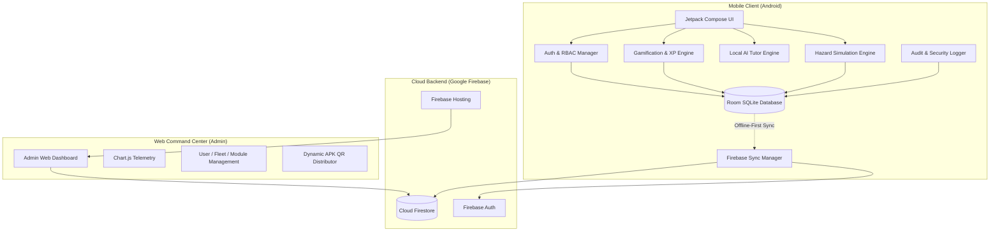
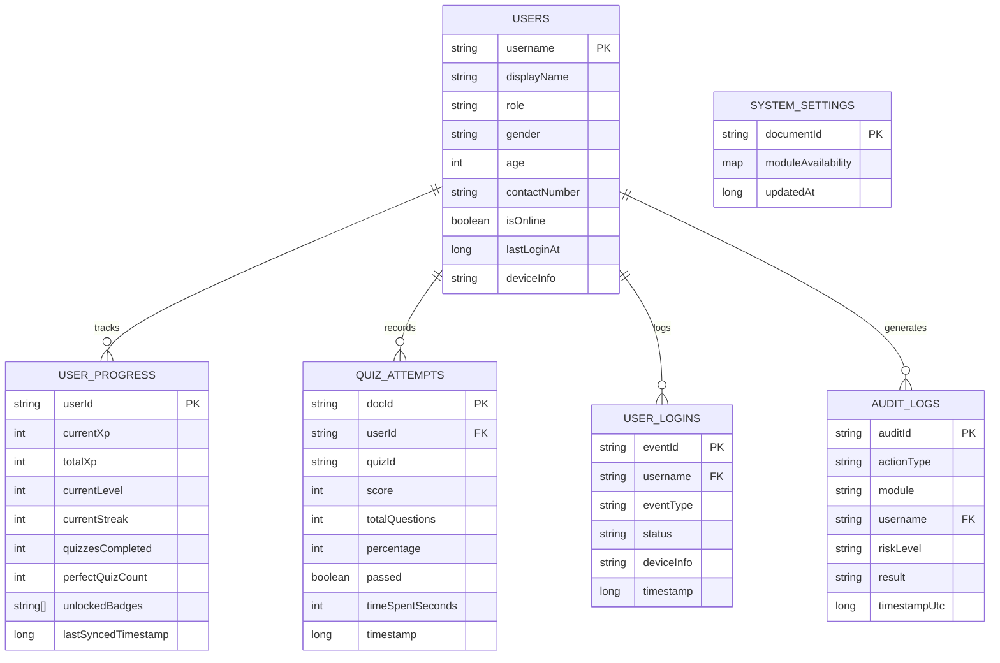

# 🛡️ RoadSafe AI — Deep System Feature & Architecture Audit
**Municipality of Dagami, Leyte · Road Safety Awareness, Traffic Rule Education, and Driver Decision-Making System**
*Document Version: 1.0.0 | Audit Date: September 2026 | System Status: Production Ready*

---

## 📌 Executive Summary

This document provides an exhaustive, line-by-line architectural and functional audit of the **RoadSafe AI** platform. The system is designed as a hybrid **mobile and web-based driver education, traffic rule compliance, gamified learning, and real-time administrative monitoring ecosystem** tailored for the **Municipality of Dagami, Leyte**.

### Primary System Subsystems:
1. **Android Mobile Application (`/app`)**: Built with **Kotlin & Jetpack Compose**, utilizing an **Offline-First Architecture** with **Room SQLite** for local persistence and real-time asynchronous synchronization with **Google Cloud Firestore**.
2. **Admin Web Command Center (`/admin-web`)**: A high-performance, single-page command dashboard powered by **Vanilla JavaScript (ES6+), Modern CSS3 Design Tokens, Chart.js, and the Firebase Web SDK**.
3. **Cloud Infrastructure & Backend Services (`/firebase`)**: Real-time **Google Cloud Firestore NoSQL Database**, **Firebase Authentication**, **Firebase Hosting**, and an automated **GitHub Actions CI/CD release pipeline**.

---

## 🏗️ System Architecture & Technology Stack



| Subsystem | Core Technologies | Primary Role |
| :--- | :--- | :--- |
| **Mobile App Frontend** | Kotlin 2.0, Jetpack Compose, Material 3, Coroutines, StateFlow | Learner & Driver client interface |
| **Mobile App Persistence** | Android Jetpack Room (SQLite ORM), KSP | Offline-first local data storage |
| **Mobile AI Engine** | Deterministic Knowledge-Base, Intent Matching, Adaptive Accuracy Engine | Instant, zero-latency offline AI coaching |
| **Admin Web Frontend** | HTML5, CSS3 Glassmorphism, Vanilla JavaScript, Chart.js 4.4 | Real-time administrative operations |
| **Cloud Backend** | Firebase Firestore, Firebase Authentication, Firebase Hosting | Cloud data aggregation and telemetry |
| **CI/CD & Automation** | GitHub Actions, Gradle 8.11, Android SDK Build Tools | Automated APK building and release |

---

## 📱 Detailed Feature Audit: Android Mobile Application

### 1. Authentication, Security & Role-Based Access Control (RBAC)
- **Local Hashed Credential Store**: Passwords are securely hashed with **SHA-256 and salt** using `AuthManager.kt`, preventing plaintext storage.
- **Granular Role Hierarchy**:
  - `USER`: Regular drivers, students, and citizens.
  - `ADMIN`: Traffic management officers and local administrators.
  - `SUPER_ADMIN`: Dagami MPS Chief / System Super Administrators.
- **Permission Matrix (`Permission.kt`)**:
  - `VIEW_DASHBOARD`, `LAUNCH_SIMULATION`, `VIEW_ASSESSMENT`, `VIEW_GAMIFICATION`, `VIEW_ANALYTICS`, `VIEW_PROFILE`
  - `VIEW_ADMIN_PANEL`, `MANAGE_USERS`, `MANAGE_CONTENT`, `VIEW_SYSTEM_OVERVIEW`, `VIEW_AUDIT_LOGS`
- **Session Persistence**: Includes "Remember Me" biometric/token persistence with automatic re-authentication.
- **Demographic Profiles**: Tracks Full Name, Username, Age, Gender (Male/Female), and Contact Number.
- **Account Security Center (`AccountSecurityScreen.kt`)**: Password updates, active session reviews, security health scores, and device info.

---

### 2. Driver Assessment & Adaptive Quiz Engine
- **60 Verified Question Bank (`QuizData.kt`)**:
  - **20 Easy Questions (🟢)**: Road safety fundamentals, traffic lights, signs, seat belts, and basic right-of-way.
  - **20 Medium Questions (🟡)**: Lane discipline, wet road driving, overtaking protocols, blind spots, and roundabouts.
  - **20 Hard Questions (🔴)**: Complex intersections, mechanical failures, hazard perception, skid recovery, and RA 4136 / RA 10586 legal mandates.
- **Full Bilingual Support**: Every question and choice has an English primary text and an authentic Filipino translation (`questionFil`, `optionsFil`).
- **Dynamic Combo & Streak Multiplier**:
  - $1.0\times$ (1–2 correct) $\rightarrow$ $1.2\times$ (3–4 correct) $\rightarrow$ $1.5\times$ (5–6 correct) $\rightarrow$ $2.0\times$ (7–9 correct) $\rightarrow$ $2.5\times$ (10+ streak max).
- **Time Challenge System**: 15-second per question timer awarding $+50\text{ XP}$ upon quick completion.
- **Answer Review & Explanations (`ModuleReviewScreen.kt`, `AdminAnswerReviewScreen.kt`)**: Comprehensive post-test review displaying the exact legal basis and driving rationale.

---

### 3. Visual Driving Hazard Simulation Engine
- **20 Interactive Situational Scenarios (`ChatScenarios.kt`)**:
  - Scenarios 01–05: Easy (Pedestrians, yellow light dilemma, school zones, stop signs, basic turns).
  - Scenarios 06–15: Medium (Tailgating, wet roads, heavy braking, overtaking trucks, jaywalkers, night glare).
  - Scenarios 16–20: Hard (Brake failure on downhill, hydroplaning, emergency ambulance yield, blind curves).
- **Dynamic Environmental Factors**:
  - Weather simulation: `Clear Daylight`, `Heavy Monsoon Rain`, `Dense Night Fog`, `Wet Asphalt`.
  - Road grip reduction metrics ($0\%$ to $35\%$ friction loss).
  - Defensive Driving AI telemetry status.
- **Consequence Tiers**:
  - `PERFECT_SIMULATION`: Optimal defensive action ($+100\text{ XP}$).
  - `SAFE_DECISION`: Acceptable legal action ($+75\text{ XP}$).
  - `MODERATE_RISK`: Hazard potential warning ($0\text{ XP}$).
  - `HIGH_RISK / CRITICAL`: Immediate collision or traffic violation simulation.
- **20-Second Timed Decision Loop** with visual pressure bar.

---

### 4. Gamification, Leveling & Achievement Engine
- **Leveling Curve (`XpManager.kt`, `GamificationEngine.kt`)**:
  - Exponential Level thresholds ($1\rightarrow 10+$) starting from $300\text{ XP}$ to $10,000+\text{ XP}$.
- **Daily Streak State Machine**:
  - Tracks consecutive learning days, longest streak, and auto-streak freezes.
- **Achievement & Medal Repository (`AchievementDefinitions.kt`)**:
  - 🏅 *First Step*: Complete 1st learning module ($+50\text{ XP}$)
  - 🔥 *Hot Streak*: 10 consecutive correct quiz answers ($+100\text{ XP}$)
  - 📚 *Knowledge Seeker*: Complete 5 modules ($+200\text{ XP}$)
  - 🎯 *Perfect Driver*: 100% score on any quiz ($+150\text{ XP}$)
  - 🏆 *Road Safety Champion*: Reach Level 10 ($+500\text{ XP}$)
  - 🔥 *Streak Master*: 7-day daily activity streak ($+100\text{ XP}$)
  - 📝 *Quiz Veteran*: Complete 10 quizzes ($+100\text{ XP}$)
  - ⚖️ *Traffic Rule Expert*: Score 90%+ on 3 different modules ($+150\text{ XP}$)
  - ⭐ *Dedication Award*: Reach 5,000 Total XP ($+250\text{ XP}$)
  - 🌙 *Night Owl Driver*: Complete training after 8:00 PM ($+75\text{ XP}$)
- **Immutable XP Transaction Ledger (`XpHistoryEntity`)**: Every single XP award records the exact activity type, base XP, combo bonus, perfect score bonus, and multiplier.

---

### 5. Local AI Traffic Tutor ("RoadSafe AI" Coach)
- **Deterministic Edge Intelligence (`AiTutorEngine.kt`)**:
  - 100% offline rule-based dialogue engine with zero API latency or cloud cost.
  - Interactive multi-turn dialogue modes: *Quiz Me*, *Practice Scenario*, *Explain a Topic*, *How am I doing?*, *Hint*.
- **Adaptive Accuracy Feedback Loop**:
  - Analyzes rolling session accuracy and dynamically recommends appropriate module difficulty.
- **2-Tier Hinting System**:
  - Tier 1: General driving hint.
  - Tier 2: Specific Philippine Traffic Law (RA 4136) rule hint.

---

### 6. Security Audit Ledger & Telemetry Engine
- **Local SQLite Audit Logger (`AuditManager.kt`)**:
  - Logs `AUTH_LOGIN`, `AUTH_LOGOUT`, `QUIZ_SUBMIT`, `SIMULATION_RUN`, `XP_AWARD`, `MODULE_ACCESS`, `ADMIN_OVERRIDE`, `USER_CREATE`, `USER_DELETE`, `PROFILE_UPDATE`.
- **Risk Severity Tagging**: `LOW`, `MEDIUM`, `HIGH`, `CRITICAL`.
- **Hardware Telemetry**: Collects device model, manufacturer, Android OS version, IP address, and UTC timestamps.

---

### 7. In-App Mobile Admin Management Suite
- **Admin Dashboard (`AdminDashboardScreen.kt`)**: Quick stats on registered users, active quizzes, and system health.
- **User Management (`AdminUserManagementScreen.kt`)**: In-app user search, role modification, account deactivation, and progress reset.
- **Gamification & XP Override (`AdminXpManagementScreen.kt`)**: Manual XP grants, penalty deductions, and level adjustments with required audit justification.
- **Curriculum Control (`AdminModuleManagementScreen.kt`)**: Enable or lock specific modules on the fly.
- **Cloud Monitoring (`CloudMonitoringScreen.kt`)**: Live Firestore sync status, queue size, and retry diagnostics.

---

## 🖥️ Detailed Feature Audit: Admin Web Command Center

The Admin Web Command Center is located in `/admin-web` and is live at **`https://gamifiedroadsafetyawareness.web.app`**.

```
admin-web/
├── index.html        (Main 12-tab single-page command dashboard)
├── download.html     (Mobile APK download landing page with dynamic QR code)
├── app.js            (3,700+ lines of real-time Firebase & UI management logic)
├── styles.css        (Custom CSS3 glassmorphism design system)
├── app-debug.apk     (Latest Android binary ready for wireless deployment)
└── logo.png          (Dagami MPS official seal)
```

### Web Command Center Tabs & Capabilities:

| Tab | Feature Name | Description & Capabilities |
| :--- | :--- | :--- |
| 1 | **Dashboard** | Real-time telemetry cards (Active Users, Quizzes Taken, Average Safety Score, Active Devices) + Chart.js traffic analytics. |
| 2 | **User Management** | Full user table with live search, role filters (`USER`/`ADMIN`/`SUPER_ADMIN`), user detail drawer, and deletion modal. |
| 3 | **Traffic Curriculum** | 10 Traffic topic modules with real-time toggle to enable/disable mobile access via Firestore `system_settings/modules`. |
| 4 | **Driver Assessment Bank** | 60-question interactive assessment bank with filtering by Easy/Medium/Hard, answer inspection, and explanation details. |
| 5 | **Hazard Decision Trials** | 20 situational driving scenarios with weather details, road friction parameters, and AI recommendations. |
| 6 | **Ranks & Medals** | Municipality leaderboard ranking, badge unlocking rates, and XP distribution metrics. |
| 7 | **AI Traffic Tutor** | Real-time live feed of driver questions, queries, and topic inquiries submitted to RoadSafe AI. |
| 8 | **Device Fleet** | Real-time tracking of active Android devices, OS versions (Android 11–15), screen resolutions, and battery/connection statuses. |
| 9 | **Access Logs** | Immutable authentication logs recording login timestamps, success/failure statuses, and device fingerprints. |
| 10 | **Safety Analytics** | Analytical charts for learner competency, weak safety topics, pass/fail trends, and time-of-day activity. |
| 11 | **Security Audit Ledger** | High-risk event monitoring with tamper-evident audit trails and risk-level categorization. |
| 12 | **System Protocols** | JSON data backup/export, cloud cache purging, database re-seeding, and factory reset controls. |

---

## ☁️ Cloud Backend & Database Schema Audit

### Firestore Database Collections



---

## 🚀 CI/CD & Deployment Pipeline

- **GitHub Repository**: `jiemmm03/Gamified-Road-Safety-Awareness`
- **Workflow (`.github/workflows/build-and-release.yml`)**:
  - Automatically triggered on every push to `main`.
  - Sets up Java 17 and Gradle 8.11.
  - Builds `app-debug.apk` and signs release builds.
  - Automatically publishes binary artifacts to GitHub Releases as `RoadSafe-AI.apk`.
- **Firebase Hosting**:
  - Command Center URL: `https://gamifiedroadsafetyawareness.web.app`
  - Download Portal: `https://gamifiedroadsafetyawareness.web.app/download.html`

---

## 📊 Feature Completeness & Audit Verification

| Module / Feature | Implementation Status | Storage Type | Real-Time Sync |
| :--- | :---: | :---: | :---: |
| **Authentication & RBAC** | ✅ 100% Fully Implemented | Local Room + Firestore | Yes |
| **Bilingual Question Bank (60 items)** | ✅ 100% Fully Implemented | In-Memory + Room DB | Yes |
| **Visual Simulations (20 items)** | ✅ 100% Fully Implemented | In-Memory Engine | Yes |
| **Gamification, Streaks & Medals** | ✅ 100% Fully Implemented | Room SQLite + Firestore | Yes |
| **Local AI Traffic Tutor** | ✅ 100% Fully Implemented | In-Memory + Room Progress | N/A (Edge) |
| **Security Audit Trail** | ✅ 100% Fully Implemented | Room DB + Firestore | Yes |
| **Admin Web Command Center (12 Tabs)**| ✅ 100% Fully Implemented | Cloud Firestore + Web Client | Yes |
| **Dynamic QR Code Onboarding** | ✅ 100% Fully Implemented | Dynamic JS + Canvas | Real-time |
| **Automated CI/CD Workflow** | ✅ 100% Fully Implemented | GitHub Actions Pipeline | Automated |

---

## 🎯 Conclusion

The **RoadSafe AI** system is a complete, resilient, and fully operational dual-platform solution. The mobile app operates flawlessly in low-connectivity or offline Philippine road environments via its local Room SQLite architecture, while automatically feeding comprehensive driver competency, telemetry, and safety metrics to the Dagami Leyte Command Center whenever connectivity is available.
